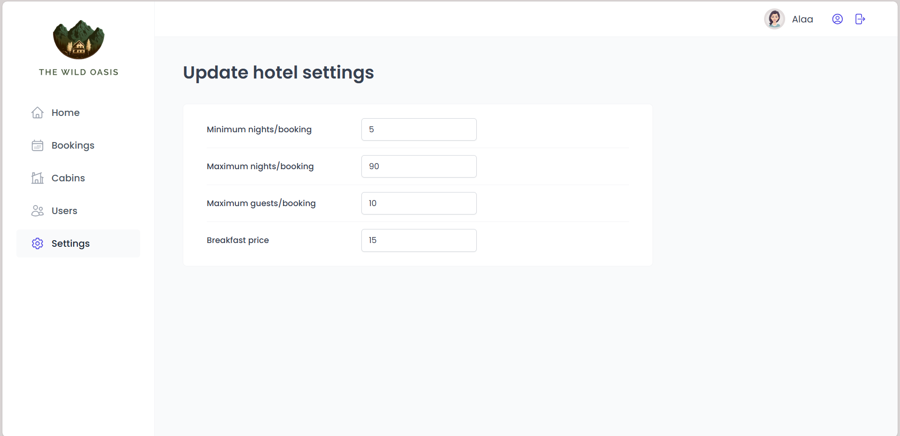

# 🏨 wild-oasis - Hotel Management System

A modern, full-featured hotel management application built with React and Supabase. This application provides a comprehensive dashboard for managing hotel operations including bookings, cabins, guests, and staff.

## 🌐 Live Demo

**🔗 [View Live Application](https://wild-oasis-beige-zeta.vercel.app/)**

> **Demo Credentials:**
>
> - Email: `salehop347@hh7f.com`
> - Password: `demo123456`

## 📸 Screenshots

### Dashboard


_Real-time statistics, sales charts, and today's activity at a glance_

### Bookings Management


_Comprehensive booking list with filtering, sorting, and pagination_

### Booking Details


_Detailed view with guest information and payment status_

### Cabins Management


_Manage all hotel cabins with easy CRUD operations_

### Check-in Process


_Streamlined guest check-in with optional breakfast addition_

### Settings


_Configure application-wide settings and preferences_

### User Profile


_User profile management with avatar upload_

## ✨ Features

### 🔐 Authentication & User Management

- Secure user authentication with Supabase
- User signup and login functionality
- Protected routes for authenticated users only
- User profile management with avatar upload
- Password update functionality
- User role management

### 📊 Dashboard

- Real-time statistics overview
- Sales charts with date range filtering (7, 30, 90 days)
- Duration charts showing stay length distribution
- Occupancy rate tracking
- Today's activity feed showing check-ins and check-outs
- Total bookings and revenue metrics

### 🏠 Cabin Management

- View all available cabins
- Add new cabins with images
- Edit existing cabin details
- Delete cabins
- Duplicate cabin entries
- Filter cabins by discount status
- Sort cabins by name, price, or capacity
- Image upload to Supabase storage

### 📅 Booking Management

- Comprehensive booking list with pagination
- Filter bookings by status (unconfirmed, checked-in, checked-out)
- Sort bookings by date or amount
- View detailed booking information
- Guest information display with country flags
- Booking price breakdown (cabin + extras)
- Delete bookings

### ✅ Check-in / Check-out

- Guest check-in with payment confirmation
- Optional breakfast addition during check-in
- Quick check-out functionality
- Today's activity tracking
- Guest status management

### ⚙️ Settings

- Configure minimum/maximum booking length
- Set maximum guests per booking
- Manage breakfast pricing
- Real-time settings updates

## 🛠️ Tech Stack

- **Frontend Framework:** React 18
- **Routing:** React Router DOM
- **State Management:** TanStack Query (React Query)
- **Styling:** Styled Components
- **Form Management:** React Hook Form
- **Backend/Database:** Supabase
- **Icons:** React Icons (Hero Icons 2)
- **Charts:** Recharts
- **Date Handling:** date-fns
- **Notifications:** React Hot Toast
- **Error Handling:** React Error Boundary

## 📦 Project Structure

```
src/
├── features/
│   ├── authentication/    # Login, signup, user management
│   ├── bookings/         # Booking list, details, operations
│   ├── cabins/           # Cabin CRUD operations
│   ├── check-in-out/     # Check-in/out functionality
│   ├── dashboard/        # Dashboard components and charts
│   └── settings/         # Application settings
├── pages/                # Page components
├── services/             # API service layer
│   ├── apiAuth.js       # Authentication API
│   ├── apiBookings.js   # Bookings API
│   ├── apiCabins.js     # Cabins API
│   ├── apiSettings.js   # Settings API
│   └── supabase.js      # Supabase client
├── ui/                   # Reusable UI components
├── hooks/                # Custom React hooks
├── utils/                # Helper functions and constants
└── styles/               # Global styles

```

## 🚀 Getting Started

### Prerequisites

- Node.js (v16 or higher)
- npm or yarn
- Supabase account

### Installation

1. **Clone the repository**

   ```bash
   git clone <repository-url>
   cd hotel-management-system
   ```

2. **Install dependencies**

   ```bash
   npm install
   ```

3. **Set up environment variables**

   Create a `.env` file in the root directory:

   ```env
   VITE_SUPABASE_URL=your_supabase_url
   VITE_SUPABASE_KEY=your_supabase_anon_key
   ```

4. **Set up Supabase**

   Create the following tables in your Supabase database:

   - `bookings` - Store booking information
   - `cabins` - Store cabin details
   - `guests` - Store guest information
   - `settings` - Store application settings

   Create storage buckets:

   - `cabin-images` - For cabin photos
   - `avatars` - For user profile pictures

5. **Start the development server**
   ```bash
   npm run dev
   ```

## 📋 Database Schema

### Bookings Table

- `id`, `created_at`, `startDate`, `endDate`
- `numNights`, `numGuests`, `cabinPrice`, `extrasPrice`, `totalPrice`
- `status`, `hasBreakfast`, `isPaid`, `observations`
- Foreign keys: `cabinId`, `guestId`

### Cabins Table

- `id`, `created_at`, `name`, `maxCapacity`
- `regularPrice`, `discount`, `description`, `image`

### Guests Table

- `id`, `created_at`, `fullName`, `email`
- `nationality`, `nationalID`, `countryFlag`

### Settings Table

- `id`, `minBookingLength`, `maxBookingLength`
- `maxGuestsPerBooking`, `breakfastPrice`

## 🎨 Key Features Implementation

### Compound Components Pattern

- Modal system for reusable dialogs
- Menus for context actions
- Table component with Header, Body, Footer

### Custom Hooks

- `useUser` - Current user authentication state
- `useBookings` - Fetch and filter bookings
- `useCabins` - Manage cabin data
- `useCheckin` / `useCheckout` - Handle check-in/out operations
- `useOutsideClick` - Close modals on outside click

### Advanced Filtering & Sorting

- URL-based state management with search params
- Client-side and server-side filtering
- Multi-field sorting capabilities
- Pagination with prefetching

### Error Handling

- Global error boundary
- Toast notifications for success/error states
- Form validation with React Hook Form

## 🔒 Security Features

- Row Level Security (RLS) policies in Supabase
- Protected routes requiring authentication
- Secure file uploads to Supabase storage
- Environment variables for sensitive data

## 📱 Responsive Design

The application is built with responsive design principles using Styled Components, ensuring a great experience across devices.

## 🧪 Development Features

- React Query DevTools for debugging
- Strict Mode enabled
- Error boundaries for graceful error handling
- Hot Module Replacement (HMR)

## 📄 Available Scripts

```bash
npm run dev          # Start development server
npm run build        # Build for production
npm run preview      # Preview production build
npm run lint         # Run ESLint
```

## 🚀 Deployment

### Deploy to Vercel

1. **Push your code to GitHub**

2. **Import to Vercel**

   - Go to [Vercel](https://vercel.com)
   - Click "New Project"
   - Import your GitHub repository

3. **Configure Environment Variables**

   Add the following environment variables in Vercel:

   ```
   VITE_SUPABASE_URL=your_supabase_url
   VITE_SUPABASE_KEY=your_supabase_anon_key
   ```

4. **Deploy**
   - Click "Deploy"
   - Your app will be live in minutes!

### Deploy to Netlify

1. **Build the project**

   ```bash
   npm run build
   ```

2. **Deploy to Netlify**

   - Drag and drop the `dist` folder to [Netlify Drop](https://app.netlify.com/drop)
   - Or connect your GitHub repository for continuous deployment

3. **Set Environment Variables**
   - Go to Site Settings > Environment Variables
   - Add `VITE_SUPABASE_URL` and `VITE_SUPABASE_KEY`

### Other Platforms

The application can be deployed to any static hosting service that supports Single Page Applications (SPA):

- **Render**
- **Railway**
- **Firebase Hosting**
- **GitHub Pages** (with proper configuration)
- **AWS S3 + CloudFront**

## 🤝 Contributing

1. Fork the repository
2. Create a feature branch (`git checkout -b feature/AmazingFeature`)
3. Commit your changes (`git commit -m 'Add some AmazingFeature'`)
4. Push to the branch (`git push origin feature/AmazingFeature`)
5. Open a Pull Request

## 📝 License

This project is licensed under the MIT License.

## 🙏 Acknowledgments

- Supabase for the amazing backend platform
- React team for the excellent framework
- All contributors and open-source libraries used in this project

---

Made with ❤️ using React and Supabase
